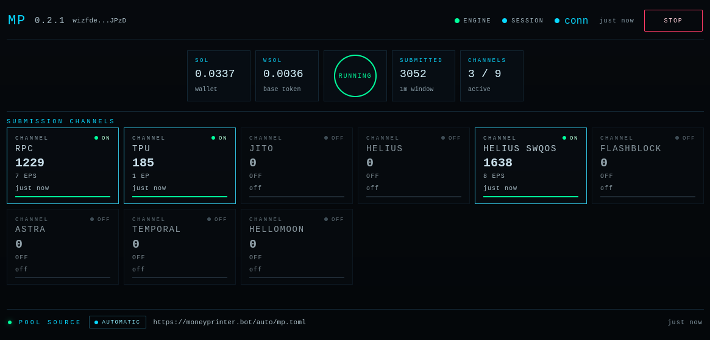

# Money Printer

**Money Printer is a self-hosted Solana arbitrage bot built for speed, reliability, and practical mainnet operation.**

It runs on your own Linux machine, watches the markets you configure, builds transactions, and delivers them through multiple execution paths.

## What It Supports

Current venue support includes:
- Meteora DLMM
- Meteora DAMM2
- Raydium CPMM
- Raydium CLMM
- Raydium Liquidity Pool V4 (AMM v4)
- Orca Whirlpool
- Pump AMM
- Tri-hop routes through USDC and USD1 when available

Current execution paths include:
- RPC
- Jito
- Helius
- Helius SWQoS
- Flashblock
- Temporal / Nozomi
- Astra
- HelloMoon

Support may evolve between releases.

## Why Use It

**Money Printer** is designed for operators who want more than generic arbitrage tooling. It delivers precise venue-aware sizing, fast and resilient execution, live runtime flexibility, and full self-hosted control — all in a system built specifically for Solana HFT arbitrage. With performance-based compensation and private-key custody staying in your hands, it is built to align with the way serious operators actually run.

## Fee Model

There is no upfront license fee.

You run the bot on your own machine and control your own wallet and environment. The software fee is **5% of net profit**, deducted only from profitable executions.

Net profit means profit after direct execution costs such as transaction fees, priority fees, tips, flash-loan fees, and similar route-related costs.

## System Requirements

Minimum recommended environment:
- Linux 64-bit / Windows 64-bit (10 and newer) with WSL2
- CPU with at least 8 cores
- Stable and fast network connection

The bot does can run on an average workstation when VPS is not available. What matters is the network connection speed and stability.

Actual performance depends heavily on hardware quality, network quality, market selection, and operating conditions.

## Quick Start

1. Download the latest release.
2. Extract the release package.
3. Review `mpconfig.example.toml`.
4. Set your keypair path, RPC endpoints, and market sources.
5. Use `launcher/mp.sh` to install or update the binary and launch the bot.

Example:

```bash
cd launcher
chmod +x mp.sh
./mp.sh --server
```

To stop the bot:

```bash
cd launcher
./mp.sh stop
```

The launcher script is the recommended way to manage the release binary. It can download the latest GitHub release, start the bot, and stop the running instance.

## Server Mode and Web Dashboard

Money Printer can run with an embedded web dashboard. You can enable it with `--server`, or through `[server_config]` in `mpconfig.toml`.

When server mode is enabled:
- the bot provides a password-protected live dashboard in the browser
- you can monitor balances, channels, endpoints, and the current market source
- you can start or stop trading from the UI
- you can switch between automatic market source mode and manual mode
- in manual mode, you can manage up to 5 pools
- you can update channel settings and enable or disable endpoints at runtime

Password handling:
- the server password is taken from `BOT_PASSWD` environment variable (if set), then `--server-pass` command line parameter (if provided), then `server_config.password`
- if no password is provided, Money Printer generates one at startup and prints it to the console

Without server mode:
- the bot still runs normally
- there is no browser dashboard
- UI start/stop control is not available
- `--paused` cannot be used

Pause behavior:
- pausing stops normal trading submission
- background wallet maintenance still continues when needed

## Wallet Behavior

- The bot maintains the configured `base_token` associated token account automatically.
- If `base_token` is WSOL, you may optionally enable automatic WSOL unwrap when wallet SOL drops below a configured minimum.
- If there is not enough SOL to recreate the required base-token account, the bot stops and logs the reason clearly.

## Key Protection

On first run, Money Printer automatically protects the configured Solana keypair file on disk and continues operating with the protected key as usual.

This reduces the risk of casual key exposure on the host machine, but it is not a substitute for proper system security and backups.

**Important:** back up your original keypair file before the first launch. Once the file has been protected by the bot, you will not be able to decrypt it yourself outside Money Printer.

## Important Notes

- Money Printer is built to make advanced Solana arbitrage more accessible and easier to operate.
- Trading is risky and profits are not guaranteed.
- You are responsible for your infrastructure, wallet security, and compliance in your jurisdiction.
